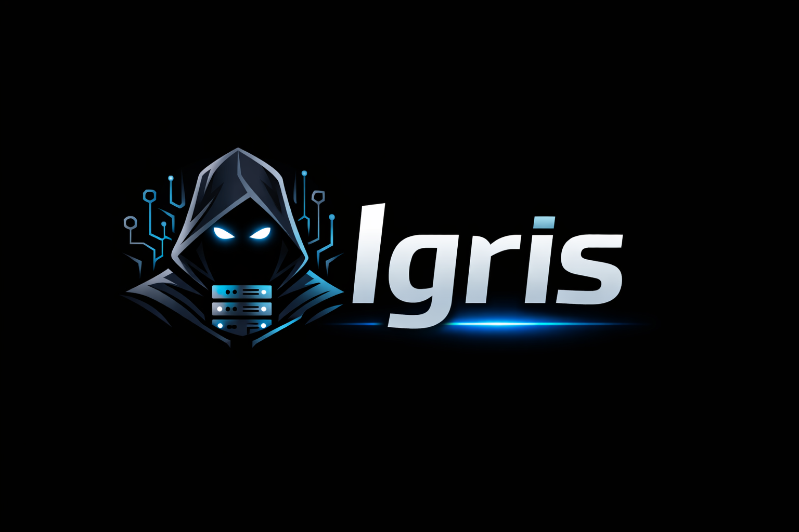

# Igris

> AI-powered server command center for Ubuntu and Debian

Igris is a self-hosted server manager built for developers who want a serious operational surface for Linux servers. It combines a web dashboard, audited command workflows, and an admin CLI so you can manage services, users, packages, firewall rules, files, processes, deployments, and alerts from one place.

<p align="center">
  
</p>

<p align="center">
  
  <a href="LICENSE"></a>
  
  
  
</p>

---

## Features

- Web dashboard for day-to-day server administration
- CLI for setup, health checks, updates, logs, tasks, and quick ops
- AI Root Assistant with server-aware suggestions, dry-run style guidance, and audited action history
- Smart application detection across service units, processes, working directories, ports, and project files
- Incident detection for failed services, crash loops, reverse proxy errors, resource pressure, and unstable deployments
- Git-based deployment workflows with deployment history and rollback-aware failure handling
- Public exposure workflow with nginx config preview, validation, and removal
- Visual system map for apps, ports, domains, and deployment relationships
- Discord and generic webhook integrations for deployment and incident events
- Service control for `systemd`
- Package management for `apt`
- Firewall management for `ufw`
- User management for local Linux accounts and sudo control
- File explorer for common admin-safe paths with upload, create, edit, download, and delete actions
- Process inspection with real-time refresh and signal actions
- Logs viewer for system and service logs
- Alert center with monitor, update, and manual alerts
- Audited console with command explanation and safer-command guidance

---

## Why Igris

Traditional server administration usually means bouncing between SSH sessions, config files, package tools, firewall commands, service logs, and deployment scripts.

Igris keeps those workflows in one operational surface without hiding what is happening underneath.

| Traditional workflow | With Igris |
| --- | --- |
| Manual shell-heavy context switching | Unified dashboard plus CLI |
| Ad hoc service and package operations | Structured controls with audit history |
| Reverse proxy changes by hand | Previewable exposure workflow |
| App discovery done manually | Smart application detection |
| Failures discovered late | Monitor, alerts, incidents, and recommendations |

---

## Installation

```bash
git clone https://github.com/hasib9797/igris
cd igris
sudo ./install.sh
sudo igris --setup
```

Dashboard default:

```text
http://YOUR_SERVER_IP:2511
```

---

## Usage

### Useful CLI commands

```bash
igris help
igris status
igris health
igris overview
igris logs
igris services failed
igris packages upgradable
igris users list
igris tasks list
igris update-check
igris alerts test
```

### Helpful system commands

```bash
sudo systemctl status igris.service
sudo journalctl -u igris.service -n 200 --no-pager
sudo ufw status
```

---

## Dashboard Modules

Current dashboard modules include:

- Overview
- AI Assistant
- Applications
- Deployments
- Incidents
- System Map
- Explain My Server
- Integrations
- Services
- Packages
- Firewall
- Users
- Tasks
- Files
- Processes
- Logs
- Alerts
- Console

---

## Tech Stack

| Layer | Technology |
| --- | --- |
| Backend | Python, FastAPI, SQLAlchemy, Pydantic |
| Frontend | React 19, TypeScript, Vite, Tailwind CSS |
| Data | SQLite |
| Runtime Inspection | psutil |
| Service Management | systemd |
| Firewall | UFW |
| Package Management | apt |
| Server Runtime | Uvicorn |
| Target OS | Ubuntu, Debian |

---

## Security

- Cookie-based dashboard authentication
- Argon2 password hashing
- Re-auth for dangerous actions
- Audit log for sensitive operations
- Confirmation before destructive or high-impact actions
- Safe command policy for AI-executed actions
- Config and runtime data stored locally on the host

---

## Architecture

The premium architecture and plugin foundation are documented in [docs/premium-architecture.md](docs/premium-architecture.md).

## Guide

The full A-to-Z product guide is available in [docs/guide.md](docs/guide.md).

---

## Roadmap

- Multi-server control
- Deeper plugin runtime loading
- Richer live terminal session multiplexing
- Expanded SSL and Cloudflare automation
- Broader runtime and app detection coverage

---

## Contributing

Contributions are welcome.

1. Fork the repository
2. Create a feature branch
3. Make your changes
4. Open a pull request

See [CONTRIBUTING.md](CONTRIBUTING.md) for contribution guidance.

---

## License

This project is licensed under the [MIT License](LICENSE).
