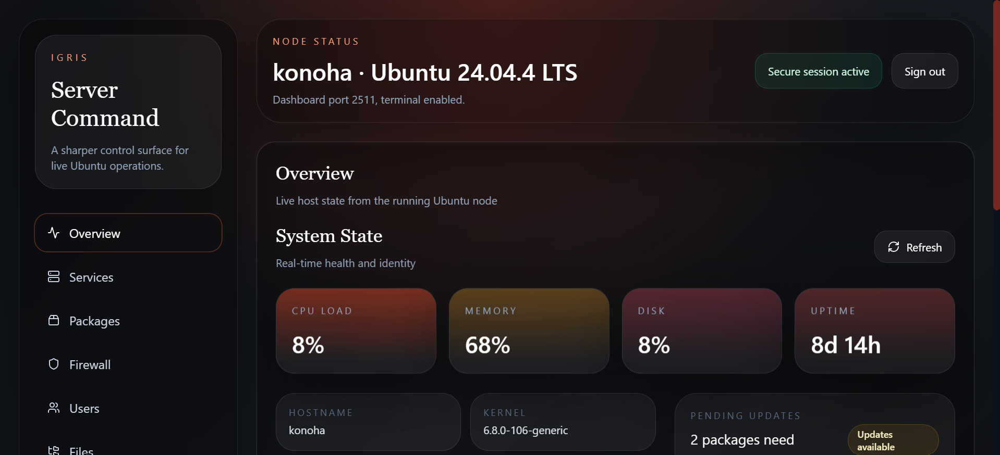

# Igris

> **Self-hosted server manager for modern Linux infrastructure**

Igris is a self-hosted server management platform for Ubuntu and Debian systems.  
It combines a web dashboard with a CLI so you can manage users, services, packages, firewall rules, and system operations from one place.

<p align="center">
  
</p>

<p align="center">
  
  <a href="LICENSE"></a>
  
  
  
</p>

---

## ✨ Features

- `🖥️` **Web dashboard** for day-to-day server operations
- `⌨️` **CLI tool** for setup and admin workflows
- `👥` **User management** for Linux accounts, passwords, and groups
- `⚙️` **Service control** powered by `systemd`
- `🛡️` **Firewall management** with UFW integration
- `📦` **Package management** using `apt`
- `📈` **System overview** for host visibility
- `📝` **Logs, processes, and diagnostics** for troubleshooting
- `📁` **Safe file browsing and text editing** under common admin paths
- `🔐` **Cookie auth and Argon2 password hashing** for dashboard access

---

## 🧠 Why Igris

Managing Linux servers usually means jumping between shell commands, config files, firewall rules, package managers, and service logs.

Igris brings those workflows into one clean interface without taking control away from you.

| Traditional Server Management | With Igris |
| --- | --- |
| Scattered commands across multiple tools | Unified dashboard + CLI |
| Repetitive admin tasks | Guided setup and common admin actions |
| Harder onboarding for teams | Cleaner, more approachable operations |
| Limited visibility without manual checks | System overview, logs, and controls in one place |
| Context switching between terminal and panels | One operational surface |

---

## ⚙️ Installation

```bash
git clone https://github.com/hasib9797/igris
cd igris
sudo ./install.sh
sudo igris --setup
```

---

## 🚀 Usage

### Open the Dashboard

After setup, access Igris in your browser:

```text
http://YOUR_SERVER_IP:2511
```

### CLI Examples

```bash
igris --setup
igris status
igris reset-admin
```

### Helpful System Commands

```bash
sudo systemctl status igris.service
sudo journalctl -u igris.service -n 200 --no-pager
sudo ufw status
```

---

## 🖥️ Dashboard Preview

<p align="center">
  
</p>


---

## 📦 Tech Stack

| Layer | Technology |
| --- | --- |
| Backend | Python, FastAPI |
| Frontend | React 19, Vite, TypeScript, Tailwind CSS |
| Auth | Cookie-based auth, Argon2 password hashing |
| Service Management | systemd |
| Firewall | UFW |
| Packages | apt |
| Data | SQLite |
| API / Runtime | Uvicorn, Pydantic, SQLAlchemy, psutil |
| Target OS | Ubuntu, Debian |

---

## 🔐 Security

- Self-hosted deployment with local infrastructure ownership
- Secure admin setup and password hashing with Argon2
- Cookie-based dashboard authentication
- Permission-aware operations for system-level actions
- Config and runtime data stored on the host under `/etc/igris` and `/var/lib/igris`

---

## 🛠️ Roadmap

- [ ] AI assistant for guided server actions
- [ ] Docker and container lifecycle management
- [ ] Multi-server control from one dashboard
- [ ] Plugin system for extensibility
- [ ] Alerting and deeper observability

---

## 🤝 Contributing

Contributions are welcome.

1. Fork the repository
2. Create a feature branch
3. Make your changes
4. Open a pull request

For contribution guidelines, see [CONTRIBUTING.md](CONTRIBUTING.md).

---

## 📄 License

This project is licensed under the [MIT License](LICENSE).

---

## ⭐ Support

If Igris helps you manage your infrastructure faster, safer, or with less friction, give the repo a star.

It helps the project grow and makes future development easier to sustain.
